

# AVR128DA48\_RNBD\_RN487x\_UserGuide

-   [Introduction](#introduction)
-   [Driver Information](#driver-information)
-   [Related Documentation](#related-documentation)
-   [Software Used](#software-used)
-   [Hardware Used](#hardware-used)
-   [Software Prerequisite](#software-prerequisite)
-   [Project Setup](#project-setup)
-   [RNBD451 Set Up and Running Example Application](#rnbd451-set-up-and-running-example-application)
    -   [RNBD Basic Data Exchange PIN Settings](#rnbd-basic-data-exchange-pin-settings)
    -   [RNBD Transparent UART Application PIN Settings](#rnbd-transparent-uart-application-pin-settings)
    -   [RNBD GPIO Based Connection Setup](#rnbd-gpio-based-connection-setup)
    -   [RNBD Code Generation & Compilation](#rnbd-code-generation-&-compilation)
    -   [RNBD Example1: Running Basic Data Exchange Example Application](#rnbd-example1:-running-basic-data-exchange-example-application)
    -   [RNBD Example2: Running Transparent UART Example Application](#rnbd-example2:-running-transparent-uart-example-application)
-   [RN487x Set Up and Running Example](#rn487x-set-up-and-running-example)
    -   [RN487x Basic Data Exchange PIN Settings](#rn487x-basic-data-exchange-pin-settings)
    -   [RN487x Transparent UART Application PIN Settings](#rn487x-transparent-uart-application-pin-settings)
    -   [RN487x Code Generation & Compilation](#rn487x-code-generation-&-compilation)
    -   [RN487x Example1: Running Basic Data Exchange Example Application](#rn487x-example1:-running-basic-data-exchange-example-application)
    -   [RN487x Example2: Running Transparent UART Example Application](#rn487x-example2:-running-transparent-uart-example-application)
-   [Summary](#summary)

# Introduction

The MPLAB® Code Configurator (MCC) [RNBD](http://mchpweb:4576/SpecIndex_FileAttach/TPT_20227216811993/70005514A.pdf)/[RN487x](https://www.microchip.com/wwwproducts/en/RN4870) BLE Modules Library allows to promptly configure the C code-generated software driver, based on the user’s selected API features available in the MCC Library. The Generated Driver code can support the BLE module using a AVR device

The library module uses a Graphic User Interface (GUI) provided by the MCC, used to set the configuration, and the custom configurations of the protocol. The Customized C code is generated within the MPLAB X project, in a folder named "MCC Generated Files".

This Library uses \(1\) UART, \(1\) GPIO, and DELAY support at minimal.

Refer to the /images folder for source files & max resolution.

# Driver Information

 

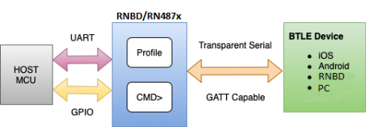

 

 

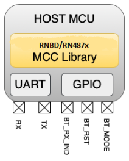

 

 

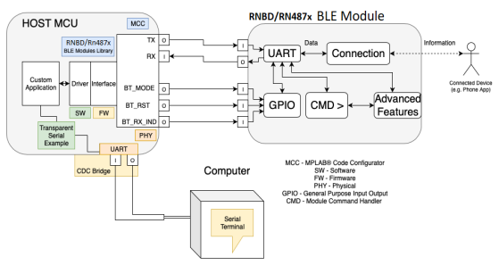

 

 

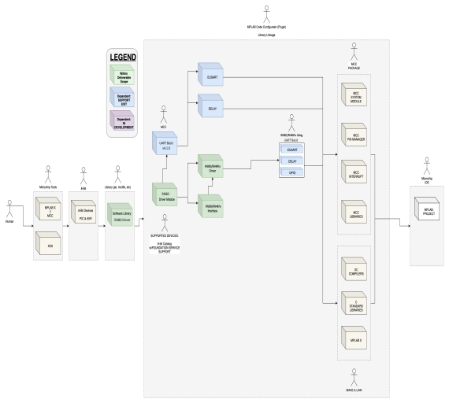

 

# Related Documentation

-   Microchip Bluetooth \([BLE](https://www.microchip.com/design-centers/wireless-connectivity/bluetooth)\)
-   RNBD User Guide \([RNBD451](http://mchpweb:4576/SpecIndex_FileAttach/TPT_20227216811993/70005514A.pdf)\)
-   RNBD Data Sheet \([RNBD451 DS](http://mchpweb:4576/SpecIndex_FileAttach/TPT_20227216811993/70005514A.pdf)\)
-   AVR128DA48 Product Page \([AVR128DA48](https://www.microchip.com/en-us/product/AVR128DA48)\)
-   RN Data Sheet \([RN4870/1](http://ww1.microchip.com/downloads/en/DeviceDoc/RN4870-71-Bluetooth-Low-Energy-Module-Data-Sheet-DS50002489D.pdf)\)

-   RN User Guide\([RN4870/1](http://ww1.microchip.com/downloads/en/DeviceDoc/RN4870-71-Bluetooth-Low-Energy-Module-User-Guide-DS50002466C.pdf)\)

# Software Used
-   MPLAB® X IDE 6.00 or newer \([microchip.com/mplab/mplab-x-ide](http://www.microchip.com/mplab/mplab-x-ide)\)
-   MPLAB® XC8 2.35 or a newer compiler \([microchip.com/mplab/compilers](http://www.microchip.com/mplab/compilers)\)
-   MPLAB® Code Configurator \(MCC\) 5.1.1 or newer \([microchip.com/mplab/mplab-code-configurator](https://www.microchip.com/mplab/mplab-code-configurator)\)
-   MPLAB® Code Configurator \(MCC\) Device Libraries AVR128Dx28/32/48/64, AVR64Dx28/32/48/64 MCUs \([microchip.com/mplab/mplab-code-configurator](https://www.microchip.com/mplab/mplab-code-configurator)\)
-   MPLAB® Code Configurator \(MCC\) Device Libraries AVR® MCUs \([microchip.com/mplab/mplab-code-configurator](https://www.microchip.com/mplab/mplab-code-configurator)\)
-   Microchip AVR-Dx\_DFP Series Device Support \(2.2.152\) or newer \([packs.download.microchip.com/](https://packs.download.microchip.com/)\)

# Hardware Used

-   AVR128DA48 Curiosity Nano Board \([DM164151](https://www.microchip.com/en-us/development-tool/DM164151)\)
-   Curiosity Nano Base Board \([AC164162](https://www.microchip.com/en-us/development-tool/AC164162)\)
-   RNBD User Guide \([RNBD451](http://mchpweb:4576/SpecIndex_FileAttach/TPT_20227216811993/70005514A.pdf)\)
-   RNBD Device Data-Sheet \([RNBD451 DS](http://mchpweb:4576/SpecIndex_FileAttach/TPT_20227216811993/70005514A.pdf)\)
-   [RN Data Sheet](http://ww1.microchip.com/downloads/en/DeviceDoc/RN4870-71-Bluetooth-Low-Energy-Module-Data-Sheet-DS50002489D.pdf)

-   [RN User Guide](http://ww1.microchip.com/downloads/en/DeviceDoc/RN4870-71-Bluetooth-Low-Energy-Module-User-Guide-DS50002466C.pdf)

# Software Prerequisite

To install the MPLAB® Code Configurator Plug-in:

1.  Open the MPLAB® Code Configurator page: [https://www.microchip.com/mcc](https://www.microchip.com/mcc)
2.  In MPLAB X IDE, select **Plugins** from the Tools menu.
3.  Select the **Available Plugins** tab.
4.  Check the box for the MPLAB® Code Configurator v3, and click **Install**.

# Project Setup

 

1.  [Create a New Project](https://www.youtube.com/watch?v=iZuucxaAVLg) in [MPLAB® X IDE](https://www.microchip.com/mplab/mplab-x-ide).

    

2.  The Validation Hardware used with Microchip Bluetooth Data Mobile App is shown in the process below. AVR128DA48 8-bit devices are used for reference.
3.  Open MCC by clicking Tools → Embedded → MPLAB® Code Configurator OR click the MCC icon. 

    or

    

4.  If MCC is not available; it is required to be installed. Navigate to Tools → Plugins. Under Available Plugins select MPLAB® Code Configurator, ensure the checkbox is selected and press **Install**. Once the installation is completed, MCC will be available.
5.  On launching MCC click on **Content Manager** button.

    |WARNING|
    |-------|
    |Kindly use mentioned Driver Version's only as shown in  the below image|

    1.  Expand Libraries section and load the available version of rnbd-rn487x-host-driver BLE Library
        -   **Common for PIC & AVR**

             

            

             

    2.  Expand Drivers section and load the below version of UART Drivers

         

        

         

         

        

         

    3.  Click the **Apply** Button to finish the Library and Driver Configurations:

         

        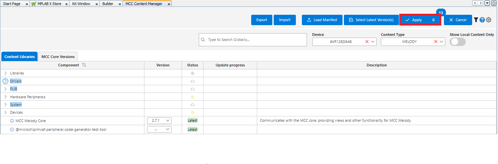

         

6.  From the **Device Resources** panel under Libraries drop down list, select: rnbd-rn487x BLE Module.

     

    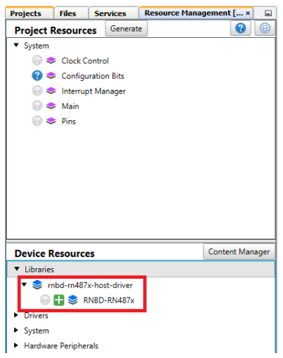

     

    Add the RNBD-RN487x from Device Resource to Project Resource as below

     

    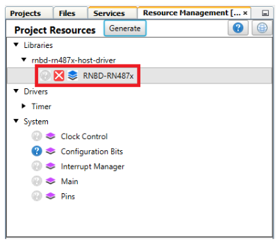

     

    Once RNBD-RN487x driver was loaded to the project resource choose  USART0 as UART Hardware Dependency Selector in which GUI will be expanded  for other configuration setting tab

     

    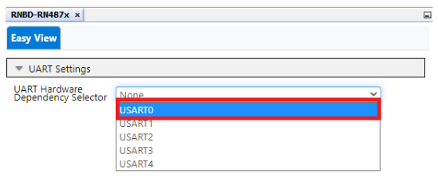

     

    After the initial setup, Default RNBD-RN487x Configuration populate  as below

     

    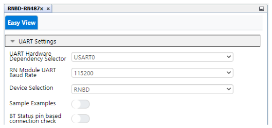

     

7.  The **Notifications \[MCC\]** tab will appear after the library addition to describe required actions. The library requires the Reset Pin to be connected to the Module, which needs to be assigned to a pin. Select and configure the dependent UART instance under Dependency Selector

    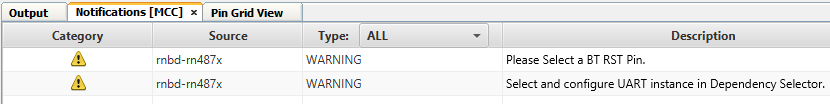

8.  Generating Example Applications:

    -   Enable Sample Examples toggle button ---\> Under Reference Example drop Down choose any of the example application as listed below,
        -   Basic Data Exchange
        -   Transparent UART Application

             

            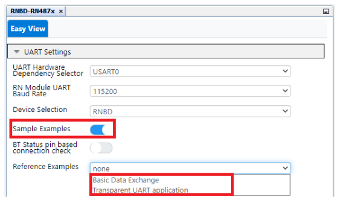

             

            **Note:** Any one of the Examples can only be  selected with is common for both RNBD/RN487x

9.  Clock Settings:
    -   From the Project Resource panel under System select Clock Control

         

        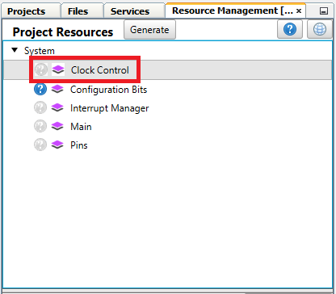

         

    -   Set Internal Oscillator Frequency to 20 MHz system clock, Prescaler **Enable** option must be toggled ON and the **Prescaler Divison** must be set to **2x**.

         

        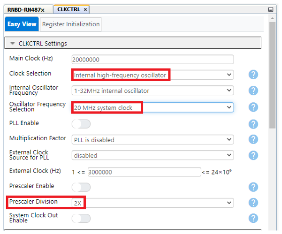

         

10. UART Settings:
    -   **AVR**
        -   **NOTE:** The below UART selections are applicable for both Transparent UART Application & Basic Data Exchange \(USART0 & USART1\)

             

            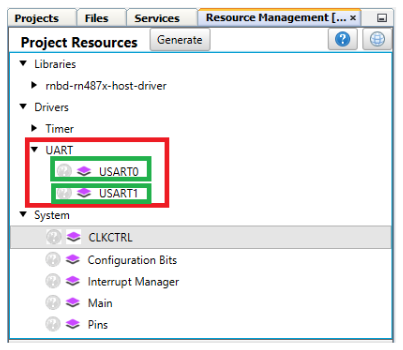

             

             

            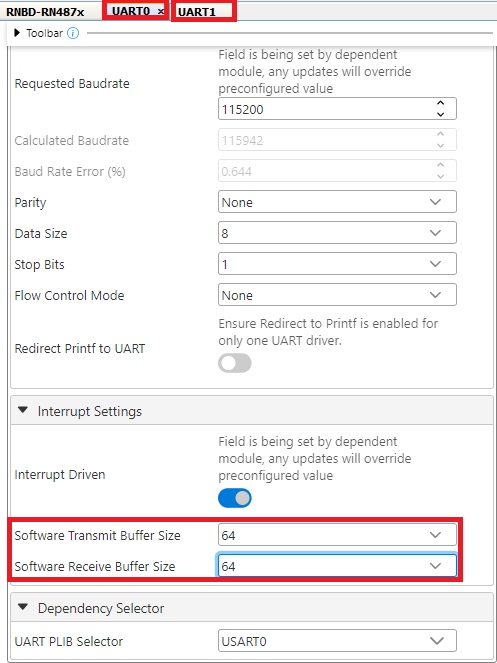

             

11. Global Interrupt Settings:
    -   Click **Interrupt Manager** under the System settings

         

        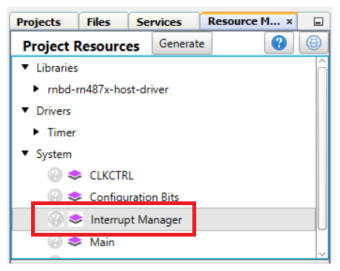

         

         

        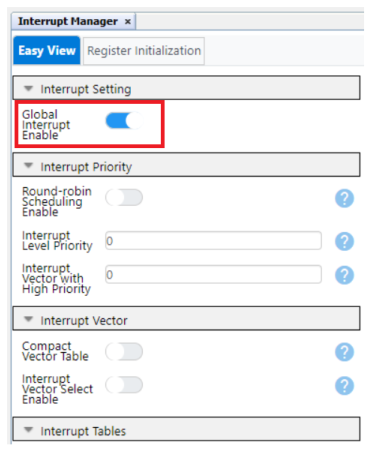

         

 

# RNBD451 Set Up and Running Example Application

This topic briefly explains the RNBD451 MPLAB X-IDE Project Setup, Code Generation, Running the Basic Data Exchange and Transparent UART Application with the AVR128DA48 Device.

## RNBD Basic Data Exchange PIN Settings

 

-   **AVR128DA48 MCC Configuration - Basic Data Exchange Example.**

     

    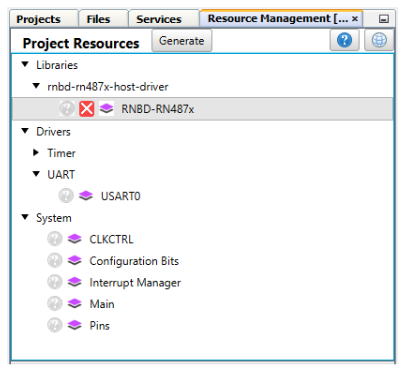

     

-   AVR128DA48 MCC Configuration - Basic Data Exchange Example

    Set **Device Selection** to **RNBD** as shown in image below

    Make sure **Sample Example** toggle button was **Enabled**

    Expand **Reference Examples** and Select **Basic Data Exchange**

     

    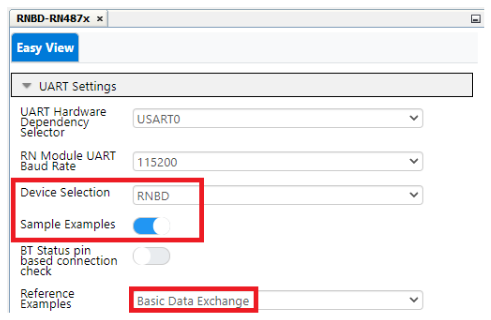

     

 

**Note:**

-   Basic Data Exchange Application uses only one instance USART0 for data transfer
-   **Important:**
    -   USART0 RxD and TxD **Uncheck** Start High and Pull-Up checkboxes.
    -   Change Rx and Tx ISC \(Input/Sense configuration\) from Interrupt Disabled but input buffer enabled to **Sense Both Edges** as shown below.

         

        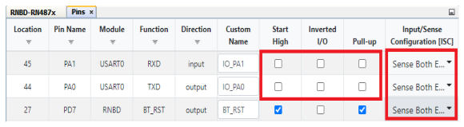

         

         

        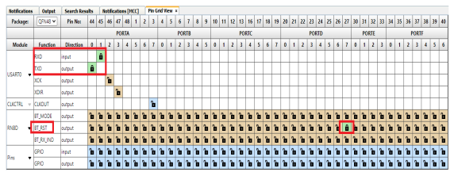

         

Configuration for AVR Basic Data Exchange was completed.

## RNBD Transparent UART Application PIN Settings

 

-   AVR128DA48 MCC Configuration - Transparent Serial Example

    Set **Device Selection** to **RNBD** as shown in image below

    Make sure **Sample Example** is enabled

    Expand **Reference Examples** and Select **Transparent UART application**

     

    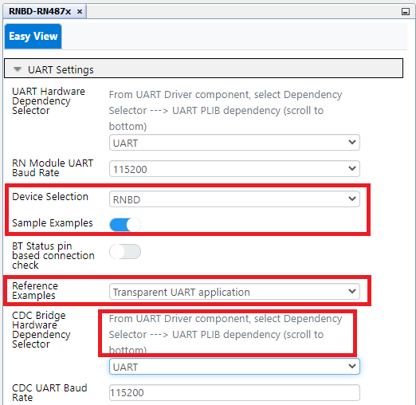

     

     

    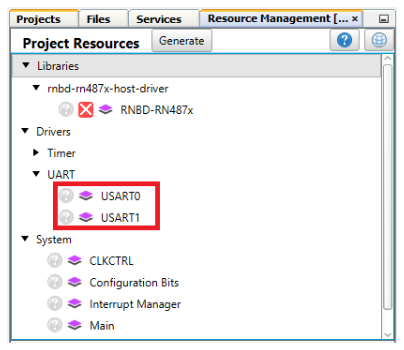

     

    **Note:**

    -   Transparent UART application uses two instances, USART0 and USART1 for data transfer

    -   Make sure Global Interrupt and USART Module Interrupt Driven was  enabled for both USART0 & USART1.

         

        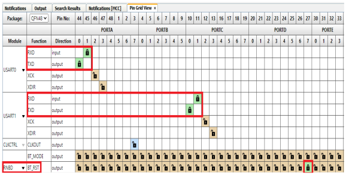

         

        **Important:**Change RxD/TxD ISC \(Input/Sense configuration\) from  Interrupt Disabled but input buffer enabled to Sense Both Edges as  shown below.

         

        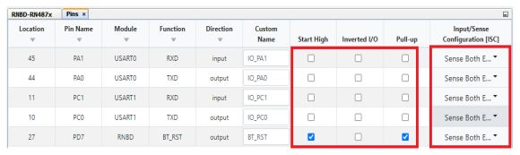

         

 

Configuration for AVR Transparent UART was completed.

## RNBD GPIO Based Connection Setup

The RNBD451 device can use BT Status indication 1 and BT Status indication 2 pins to indicate the GPIO connection status. Besides monitoring the connect message in the serial UART prints, this feature is useful when the Host MCU can verify the BT connection status, by monitoring the status indication pins.

**Ble Status Indication Pin Table:**

 

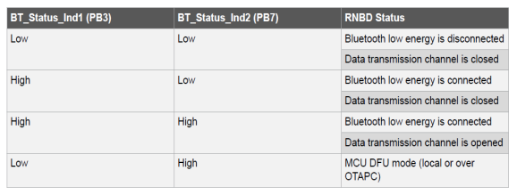

 

**PIN Mapping Between RNBD BLE Status 1 & 2 Pins with PIC18F47Q10:**

 

|Pin Functionality|RNBD Pin Number|PIC18F47Q10 Pin Number|
|-----------------|---------------|----------------------|
|Ble Status Indication 1|PB3|PA6|
|Ble Status Indication 2|PB7|PA5|

 

 

1.  Selecting GPIO Based Connection for Both Basic Data Exchange & Transparent UART Application

     

    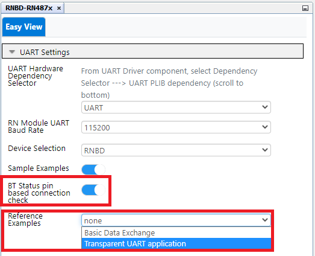

     

2.  Pin Selection for Status Indication 1 & 2 Pins under Pin Grid View:

     

    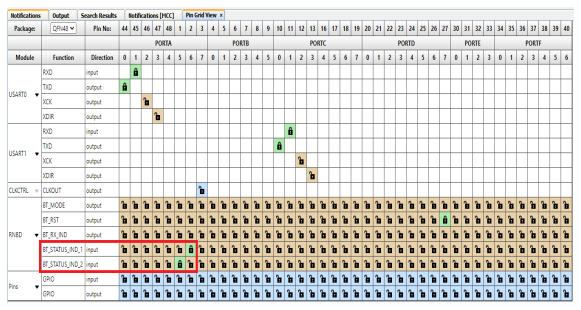

     

3.  Pins Setting under Project Resource:

     

    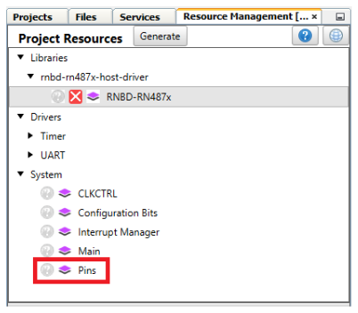

     

    By Default Start High, Pull-Up, checks will be selected for Status Indication Pin 1 and 2

     

    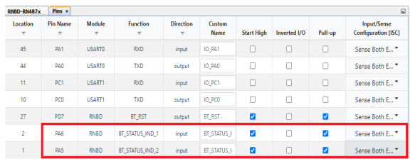

     

    **Uncheck** the Start High, Pull-Up checks as shown in the below  picture

    Make sure Status Ind1 & Status Ind2 pins are configured with Sense Both  Edges as shown below

     

    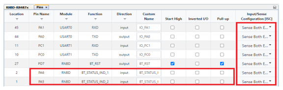

     

 

## RNBD Code Generation & Compilation

 

1.  Click the **Generate** button which will be next to Project Resource

     

    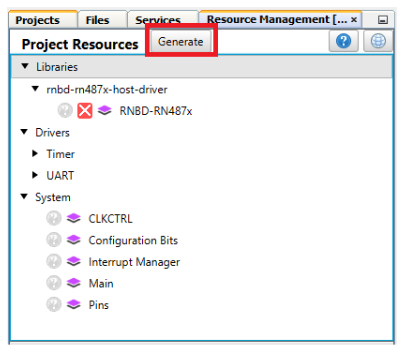

     

2.  Include the header \#include "mcc\_generated\_files/examples/rnbd\_example.h" in **main.c**

3.  Call the function **Example\_Initialized\(\);** in **main\(\)** after **SYSTEM\_Initialize\(\)**.

     

    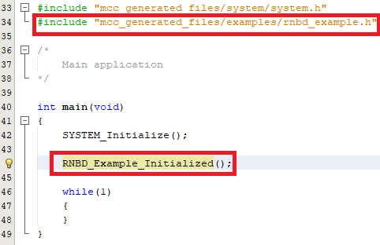

     

4.  Pin Mapping Table between MCU & RNBD Click

     

    |S.no|PIN Functionality|AVR|RNBD Click|
    |----|-----------------|---|----------|
    |1|Receive \(RxD\)|RA1|Tx|
    |2|Transmit \(TxD\)|RA0|Rx|
    |3|BT\_RST|RD7|RST|

     

5.  Connect the development board of your choice and connect the RNBD to the proper slot\(\) as shown below.

    **Note:** Connect RNBD Click to **Slot 1** as shown in the image below:

     

    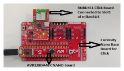

     

    **Important:** The slot was decided based on the UART Instances which were configured for this example \(**PIN Mapping between MCU and RNBD Click**\).

6.  Build the Generated Project:

    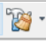

7.  Program to the Board:

    

 

## RNBD Example1: Running Basic Data Exchange Example Application

**Basic Data Exchange:**

This example shows how a MCU can be programmed to transmit data to a smart phone over BLE. Here the MCU device will send Periodic Transmission of a single character when **STREAM\_OPEN** is processed through the Message Handler. This indicates to the MCU and RNBD Module that the application is in a DATA STREAMING mode of operation and can expect to hear data over the BLE connection.  \#define DEMO\_PERIODIC\_CHARACTER \(‘1’\) are used in the example can be found \#defined at the top of  rnbd\_example.c.|

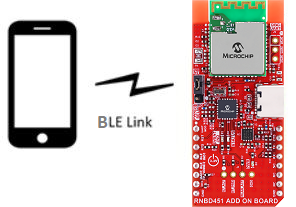

1.  Download and Install the Phone Application for demonstration:
    1.  **Microchip Bluetooth Data** by **Microchip** from the [App Store](https://apps.apple.com/us/app/microchip-bluetooth-data/id1319166097) or from [Google Play Store](https://play.google.com/store/apps/details?id=com.microchip.bluetooth.data&hl=en_IN&gl=US).
2.  Launch the Phone Application

    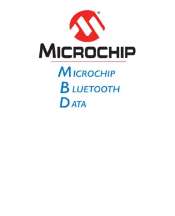

     

    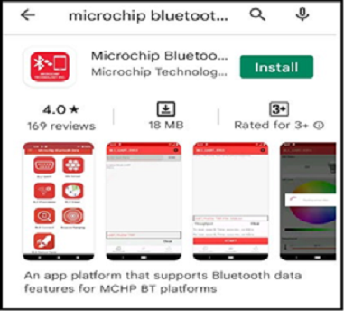

     

    Click on the **BLE Smart** Sub Apps as shown below:

    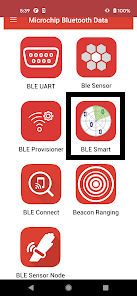

3.  The Application scans the area for Bluetooth devices within a range. Look for "RNBD" devices under the scanned list.

     

    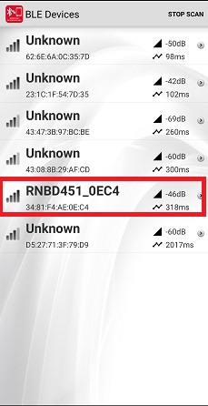

     

4.  On selecting the "RNBD" device from the list will be ready to connect with RNBD Module once you click on CONNECT Button

     

    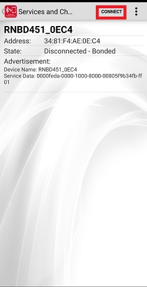

     

5.  Once connected Microchip Bluetooth App discovers all the services and characteristics supported by the RNBD451 device as shown in the following figure.

    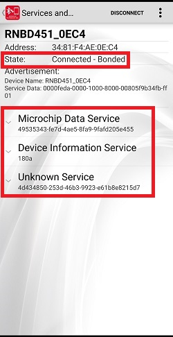

6.  Click on **Microchip Data Service** Option, select the **Microchip Data Characteristic** and Write Notify Indication to receive the data in Mobile App.

    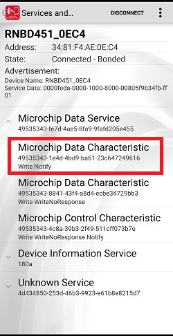

7.  Select **Listen for notifications** on the application.
    -   It may be required to "enable notification" access to the app on the  phone.

        Data will begin to Send at a Periodic Rate to the device.

        Data will become visible beneath the Notify/Listen Toggle Option.

        -   Before Enabling the Notify/Indicate Toggle Button:

            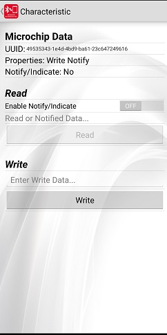

            After Enabling the  Notify/Indicate Toggle Button Mobile App can read the data  31\(Hex Value\) which was sent from RNBD Module.

            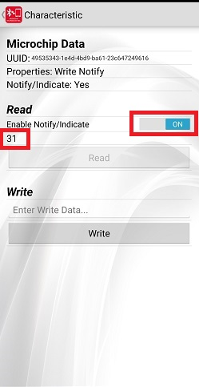

This is the END of the Basic Data Exchange Example

## RNBD Example2: Running Transparent UART Example Application

 

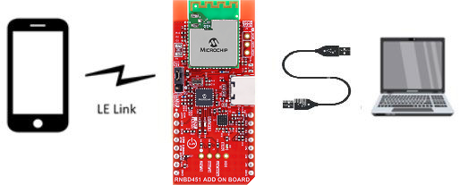

 

 

|Transparent Serial:|
|-------------------|
|  This example shows how the data transmitted from a PC serial terminal is written to a smart phone app and the vice versa. The MCU acts as a bridge while passing data between RNDB Module <--- MCU ---> Serial Terminal.   This action will occur when STREAM\_OPEN is processed through the Message Handler. For this example, data typed into the Serial Terminal will appear on the BLE Phone Application,and Data sent from the Application will appear on the Serial Terminal. |

 

1.  Download and Install Phone Application for demonstration:
    -   **Microchip Bluetooth Data** by **Microchip** from the [App Store](https://apps.apple.com/us/app/microchip-bluetooth-data/id1319166097) or from [Google Play](https://play.google.com/store/apps/details?id=com.microchip.bluetooth.data&hl=en_IN&gl=US).
2.  Launch the Phone Application

    

    

     

    

     

    After the installation is complete, open the MDB APP and click on **BLE UART** Sub Apps:

     

    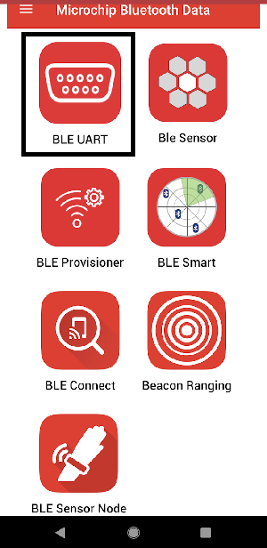

     

3.  Select **PIC32CXBZ** to scan for available devices to connect. The application automatically scans the area for Bluetooth devices within a range. By default, the devices appear as "RNBD451_xxxx"

     

    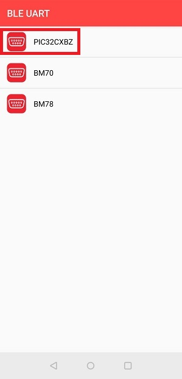

     

4.  For Transparent Serial only: Open a "Serial Terminal" program such as Tera Term, Realterm, PuTTY, Serial; or similar. Baud Rate will be configured as: 115200

     

    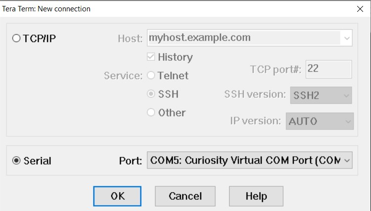

     

     

    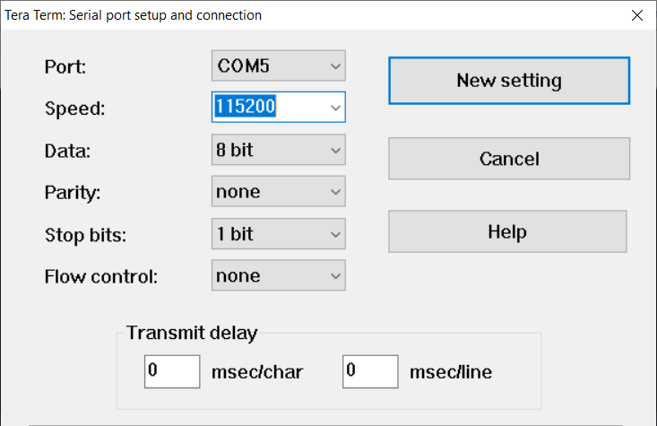

     

5.  Once Connected with RNBD451\_0EC4 click on Text Mode at bottom of the settings as shown below to initiate the data transfer.

     

    

     

    - Check Serial Terminal for the status of the connection.

     

    

     

6.  Enter the text to be transferred from mobile to RNB45x device and click the **Send** button

     

    

     

    - The data will be received at the RNBD45x side and will be displayed in  serial terminal of RNBD45x

     

    

     

7.  Type any data on the serial terminal of the RNBD45x to send to the Microchip Bluetooth Data App, which is received and printed on the receive view of the Microchip Bluetooth App.

     

    

     

     

    

     

This is the END of the Transparent UART Example

# RN487x Set Up and Running Example

This topic briefly explains the RN487x MPLAB X-IDE Project Setup, Code Generation, Running the Basic Data Exchange and Transparent UART Application with the AVR128DA48 Device.

## RN487x Basic Data Exchange PIN Settings

 

-   **AVR128DA48 MCC Configuration - Basic Data Exchange Example**

     

    

     

    Set **Device Selection** to **RN487x** as shown in below image
      Make sure **Sample Example** Toggle button was **Enabled**

    Expand **Reference Examples** and Select **Basic Data Exchange**

     

    

     

 

**Note:**

-   Basic Data Exchange Application uses only one instance of **USART0** for data transfer
-   **Important:**
    -   USART0 RxD and TxD **Uncheck** Start High and Pull-up checkboxes.
    -   Change Rx and Tx ISC \(Input/Sense configuration\) from Interrupt Disabled but input buffer enabled to **Sense Both Edges** as shown below.

         

        

         

         

        

         

Configuration for AVR Basic Data Exchange was completed.

## RN487x Transparent UART Application PIN Settings

 

-   AVR128DA48 MCC Configuration - Transparent Serial Example

    Set **Device Selection** to **RN487x** as shown in below image

    Make sure **Sample Example** Toggle button was **Enabled**

    Expand **Reference Examples** and Select **Transparent UART application**

     

    

     

     

    

     

 

**Note:**

-   Transparent UART Application uses USART0 and USART1 for data transfer

-   Make sure Global Interrupt and USART Module Interrupt Driven was enabled for both **USART0 and USART1**.

     

    

     

    **Important:** Change RxD and TxD ISC \(Input/Sense configuration\) from **Interrupt Disabled but input buffer enabled** to **Sense Both Edges** as shown above.

     

    

     

Configuration for AVR Transparent UART was completed.

## RN487x Code Generation & Compilation

 

1.  Click the **Generate** button which will be next to Project Resource

     

    

     

2.  Include the header \#include "mcc\_generated\_files/examples/rn487x\_example.h" in **main.c**

3.  Call the function **Example\_Initialized\(\);** in **main\(\)** after **SYSTEM\_Initialize\(\)**

     

    

     

4.  Pin Mapping Table between MCU & RN4871 Click

     

    |S.no|PIN Functionality|AVR|RN487x Click|
    |----|-----------------|---|------------|
    |1|Receive \(RxD\)|RA1|Tx|
    |2|Transmit \(TxD\)|RA0|Rx|
    |3|BT\_RST|RD7|RST|

     

5.  Connect the development board of your choice and connect the RN487x to the proper slot\(\) as shown below.

    **Note:** Connect RN4871 Click to **Slot 1** as shown in below image

     

    

     

    **Important:** The slot was decided based on the UART Instances which were configured for this example (**PIN Mapping between MCU and RN4871**).

6.  Build the Generated Project:

    

7.  Program to the Board:

    

 

## RN487x Example1: Running Basic Data Exchange Example Application

**Basic Data Exchange:**

This example shows how a MCU can be programmed to transmit data to a smart phone over BLE. Here the MCU device will send Periodic Transmission of a single character when **STREAM\_OPEN** is processed through the Message Handler. This indicates to the MCU and RN487x Module that the application is in a DATA STREAMING mode  of operation; and can expect to hear data over the BLE connection.

\#define DEMO\_PERIODIC\_TRANSMIT\_COUNT\(10000\)\#define DEMO\_PERIODIC\_CHARACTER \(‘1’\) are used in the example can be found \#defined at the top of rnbd\_example.c.

1.  Download and Install Phone Application for demonstration:
    1.  **Microchip Bluetooth Data** by **Microchip** from the [App Store](https://apps.apple.com/us/app/microchip-bluetooth-data/id1319166097) or from [Google Play Store](https://play.google.com/store/apps/details?id=com.microchip.bluetooth.data&hl=en_IN&gl=US).
2.  Launch the Phone Application

    

     

    

     

    Click the **BLE Smart** Sub Apps as shown below:

    

3.  The Application scans the area for Bluetooth devices within a range. Look for "RN487x" devices under the scanned list.

     

    

     

4.  On selecting the "RN487x" device from the list will be ready to connect with RNBD Module once you click on CONNECT Button

     

    

     

5.  Once connected, the Microchip Bluetooth App discovers all the services and characteristics supported by the RN487x device, as shown in the following figure.

     

    

     

6.  Click on **Microchip Data Service** Option, select **Microchip Data Characteristic** and Write Notify Indication to receive the data in the Mobile App.

     

    

     

7.  Select **Listen for notifications** on the application.
    -   It may be required to "enable notification" access to the app on the  phone.

        Data will begin to Send at a Periodic Rate to the device.

        Data will become visible beneath the Notify/Listen Toggle Option.

        -   Before Enabling the Notify/Indicate Toggle Button:

             

            

             

            After Enabling the Notify/Indicate Toggle Button Mobile  App can read the data 31\(Hex Value\) which was sent from  RN487x Module.

            

This is the END of the Basic Data Exchange Example

## RN487x Example2: Running Transparent UART Example Application

 

 

 

|Transparent Serial:|
|-------------------|
|  This example shows how the data transmitted from a PC serial terminal is written to a smart phone app and the vice versa. The MCU acts as a bridge while passing data between RNDB Module <--- MCU ---> Serial Terminal.   This action will occur when STREAM\_OPEN is processed through the Message Handler. For this example, data typed into the Serial Terminal will appear on the BLE Phone Application,and Data sent from the Application will appear on the Serial Terminal. |

 

1.  Download and Install Phone Application for demonstration:
    -   **Microchip Bluetooth Data** by **Microchip** from the [App Store](https://apps.apple.com/us/app/microchip-bluetooth-data/id1319166097) or from [Google Play](https://play.google.com/store/apps/details?id=com.microchip.bluetooth.data&hl=en_IN&gl=US).
2.  Launch the Phone Application

    

    

     

    

     

    After the installation is complete, open the MBD and click **BLE UART** Sub Apps:

     

    

     

3.  On Selecting BM70 scan for available devices to connect.

     

    

     

    Click on the below Scan image to scan the Nearby "RN487x-xxxx"

     

    

     

    The Application will automatically scan the area for Bluetooth devices within  a range. By default, the device should appear as "RN487x-xxxx"

     

    

     

4.  For Transparent Serial only: Open a "Serial Terminal" Program such as Tera Term, Realterm, PuTTY, Serial; or similar. Baud Rate will be configured as: 115200

     

    

     

     

    

     

5.  Once Connected with RN487x-xxxx click **Transfer data to device** as shown below to initiate the data transfer.

     

    

     

    - Check Serial Terminal for the status of the connection.

     

    

     

6.  Enter the text to be transferred from mobile to RN487x-xxxx device and click **Send**

     

    

     

    - The data will be received at the RN487x-xxxx side and will be displayed in  serial terminal of RNBD45x

     

    

     

7.  Type any data on the serial terminal of the RN487x-xxxx to send to the Microchip Bluetooth Data App, which is received and printed on the receive view of the Microchip Bluetooth App.

     

    

     

     

    

     

# Summary

**Command, Data Communication with Asynchronized Message Processing:**

This driver contains, at its' core, the inherent code capability of distinguishing  between **Message** exchange and **Data** exchange between the connected MCU and  Module devices.

The library supplies all required Application Programming Interfaces \(APIs\) required to  create functional

implementation of operation a BLE connected end-device.

Through the MCC configuration the physical connection of the \(3\) required pins can be  selected through the GUI.

These are the \(2\) UART pins used for communication, and control of the **RST\_N**  connected to the RNBD Module.

Additionally; this Library allows for extension of Module pin behaviors through the  simple RNBD Module object

interface; where any device/project specific instantiations exist.  **rnbd\_interface.c/h**/**rn487x\_interface.c/h**

A brief description of the Interface, and object extension is described below:

iRNBD\_FunctionPtrs\_t is a typedef struct which can be found in  **rnbd\_interface.h**/**rn487x\_interface.h** and consist of \(9\) function  pointers. In the **rnbd\_interface.c**/**rn487x\_interface.c**, the concrete  creation of RNBD as an object is instantiated. Within  **rnbd\_interface.c**/**rn487x\_interface.c** are the **private static**  implementations of desired behavior. In some cases, such as DELAY or UART, the  supporting behavior is supplied through another supporting library module. When  applicable ‘inline’ has been used to reduce stack depth overhead.

 

 

 

 

The driver library itself should not require any modifications or injections by the user;  unless to expand upon the supported command implementations **rnbd.c/h**

**Configurable Module Hardware Requirement\(s\):**

A single UART instance used for communication between MCU and Module:

 

 

The Library allows for configuration of \(3\) Pins associated with support features  extended through the Driver Interface. Only \(1\) Pin is required by the RNBD Modules for  operation; this is the modules **RESET** pin.

 

 

 

|Library Name: Output\(s\)|Module: Input\(s\)|Description|Module Physical Defaults|
|-------------------------|------------------|-----------|------------------------|
|BT\_MODE|P2\_0|  1 : Application Mode  0 : Test Mode/Flash Update/EEPROM Configuration |Active-Low, Internal Pull-High|
|BT\_RST|RST\_N|Module Reset|Active-Low, Internal Pull-High|
|BT\_RX\_IND|P3\_3|Configured as UART RX Indication pin|Active-Low|

 
