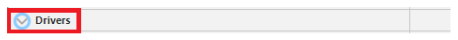
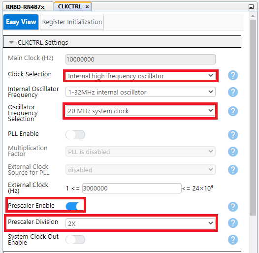
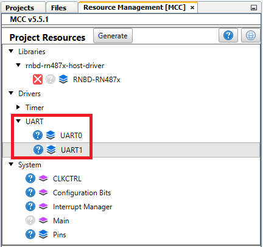
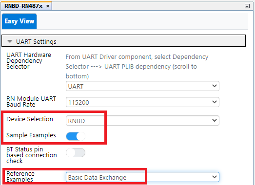
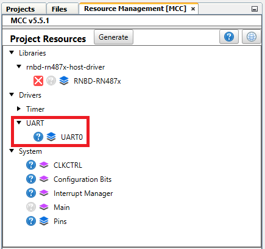
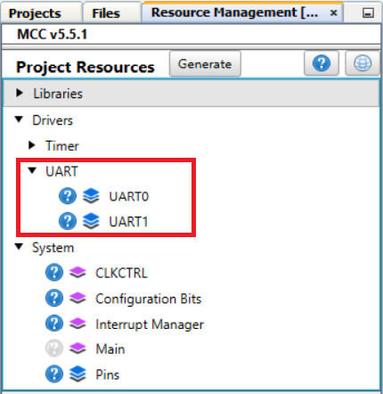
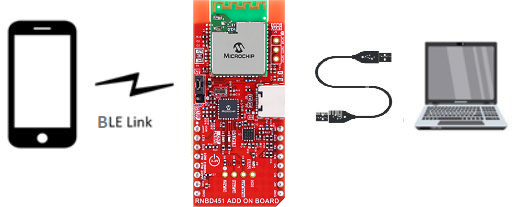
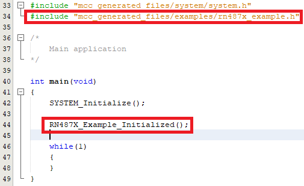

# AVR128DA48 RNBD and RN487x User Guide

-   [Introduction](#introduction)
-   [Driver Information](#driver-information)
-   [Related Documentation](#related-documentation)
-   [Software Used](#software-used)
-   [Hardware Used](#hardware-used)
-   [Hardware Setup](#hardware-setup)
-   [Software Prerequisite](#software-prerequisite)
-   [Project Setup](#project-setup)
-   [RNBD Setup and Running Example Application](#rnbd-setup-and-running-example-application)
    -   [RNBD Basic Data Exchange Pin Settings](#rnbd-basic-data-exchange-pin-settings)
    -   [RNBD Transparent UART Application Pin Settings](#rnbd-transparent-uart-application-pin-settings)
    -   [RNBD GPIO Based Connection Setup](#rnbd-gpio-based-connection-setup)
    -   [RNBD Code Generation and Compilation](#rnbd-code-generation-&-compilation)
    -   [RNBD Example 1: Running Basic Data Exchange Example Application](#rnbd-example1:-running-basic-data-exchange-example-application)
    -   [RNBD Example 2: Running Transparent UART Example Application](#rnbd-example2:-running-transparent-uart-example-application)
-   [RN487x Setup and Running Example](#rn487x-setup-and-running-example)
    -   [RN487x Basic Data Exchange Pin Settings](#rn487x-basic-data-exchange-pin-settings)
    -   [RN487x Transparent UART Application Pin Settings](#rn487x-transparent-uart-application-pin-settings)
    -   [RN487x Code Generation and Compilation](#rn487x-code-generation-&-compilation)
    -   [RN487x Example 1: Running Basic Data Exchange Example Application](#rn487x-example1:-running-basic-data-exchange-example-application)
    -   [RN487x Example 2: Running Transparent UART Example Application](#rn487x-example2:-running-transparent-uart-example-application)
-   [Summary](#summary)

 
**Notes** 
 1. The project creation steps where RNBD is mentioned are applicable for both RNBD451 and RNBD350 devices.
  
 2. The Over-the-Air (OTA) Device Firmware Update (DFU) support is not applicable for RNBD350-based applications because the OTA DFU for RNBD350 is implemented using the Host Microcontroller (MCU) DFU process. OTA is not supported for 8-bit applications due to memory limitation.

# Introduction

The MPLAB® Code Configurator (MCC) [RNBD](https://www.microchip.com/en-us/product/RNBD451PE)/[RN487x](https://www.microchip.com/wwwproducts/en/RN4870) Bluetooth® Low Energy (BLE) Modules Library allows to promptly configure the C code-generated software driver, based on the user’s selected Application Programming Interfaces (API)  features available in the MCC Library. The generated driver code can support the BLE module using a AVR® device.

Refer to the /images folder for source files and max resolution.

The library module uses an MCC Graphic User Interface (GUI) to set the configuration, along with the custom configurations of the protocol. The customized C code is generated in a folder named "MCC Generated Files" within the MPLABX project.

This library uses one Universal Asynchronous Receiver and Transmitter (UART), one General Purpose Input/Output (GPIO) and DELAY support at minimal.

# Driver Information

 

 

 

 

 

 

 

 

# Related Documentation

-   Microchip Bluetooth Low Energy \([BLE](https://www.microchip.com/design-centers/wireless-connectivity/bluetooth)\)
-   RNBD User Guide \([RNBD451](https://onlinedocs.microchip.com/oxy/GUID-26457D23-798C-47B0-9F40-C5DA6E995C6F-en-US-2/index.html)\)
-  RNBD Data Sheet \([RNBD451 DS](http://mchpweb:4576/SpecIndex_FileAttach/TPT_20227216811993/70005514A.pdf)\)
-   AVR128DA48 Product Page \([AVR128DA48](https://www.microchip.com/en-us/product/AVR128DA48)\)
-   RN Data Sheet \([RN4870/1](http://ww1.microchip.com/downloads/en/DeviceDoc/RN4870-71-Bluetooth-Low-Energy-Module-Data-Sheet-DS50002489D.pdf)\)

-   RN User Guide ([RN4870/1](http://ww1.microchip.com/downloads/en/DeviceDoc/RN4870-71-Bluetooth-Low-Energy-Module-User-Guide-DS50002466C.pdf)\)

# Software Used
-   [MPLAB® X IDE 6.20](http://www.microchip.com/mplab/mplab-x-ide) or newer

-   [MPLAB XC8 2.46](http://www.microchip.com/mplab/compilers) or newer
-   [MPLAB Code Configurator 5.5.1](https://www.microchip.com/mplab/mplab-code-configurator) or newer
-   [MPLAB Code Configurator](https://www.microchip.com/mplab/mplab-code-configurator) Device Libraries AVR128Dx28/32/48/64, AVR64Dx28/32/48/64 Microcontrollers (MCUs)
-   [MPLAB Code Configurator](https://www.microchip.com/mplab/mplab-code-configurator) Device Libraries AVR® MCUs
-   [Microchip AVR-Dx_DFP Series Device Support \(2.5.294\)](https://packs.download.microchip.com) or newer

# Hardware Used

-   AVR128DA48 Curiosity Nano Board \([DM164151](https://www.microchip.com/en-us/development-tool/DM164151)\)
-   Curiosity Nano Base for Click Boards™ \([AC164162](https://www.microchip.com/en-us/development-tool/AC164162)\)

# Hardware Setup
## RNBD Pin Mapping and Hardware Setup
-   Pin mapping table between the MCU and the RNBD Click:

    | S. No | Pin Functionality | AVR |  RNBD  Click  |
    |-------|-------------------|-----|---------------|
    |   1   | Receive (RxD)     | RA1 |     Tx        |
    |   2   | Transmit (TxD)    | RA0 |     Rx        |
    |   3   | BT_RST            | RD7 |     RST       |

-   Connect the development board of your choice and then connect the RNBD to the proper slot. The image below shows how to connect the RNBD Click to **Slot 1**.

    

    **Important:** The slot was decided based on the UART instances which were configured for this example (see the pin mapping table between the MCU and the RNBD Click).
## RN487x Pin Mapping and Hardware Setup
-   Pin mapping table between the MCU and the RN487x Click:

    | S. No | Pin Functionality | AVR | RN487x Click |
    |-------|-------------------|-----|--------------|
    |   1   | Receive (RxD)     | RA1 |     Tx       |
    |   2   | Transmit (TxD)    | RA0 |     Rx       |
    |   3   | BT_RST            | RD7 |     RST      |

-   Connect the development board of your choice and then connect the RN487x to the proper slot. The image below shows how to connect the RN487x Click to **Slot 1**.

    

    **Important:** The slot was decided based on the UART instances which were configured for this example application (see the pin mapping table between the MCU and the RN487x Click).

# Software Prerequisite

Install the MPLAB Code Configurator Plug-in:

1.  Go to the MPLAB Code Configurator [page](https://www.microchip.com/mcc).
2.  In MPLAB X IDE, select Plugins from the Tools menu.
3.  Select the **Available Plugins** tab.
4.  Check the box for the MPLAB Code Configurator v3 and click **Install**.

# Project Setup

**Note:** The Validation Hardware used with Microchip Bluetooth Data Mobile App is shown in the process below. AVR128DA48 8-bit devices are used for reference.
 

1.  [Create a New Project](https://www.youtube.com/watch?v=iZuucxaAVLg) in [MPLAB X IDE](https://www.microchip.com/mplab/mplab-x-ide).

    

2.  Open MCC by clicking _Tools→Embedded→MPLAB® Code Configurator_ or click the **MCC** button.

     

    

    or

    

3.  If MCC is not available, install it. Navigate to _Tools→Plugins_. Under **Available Plugins** select "MPLAB Code Configurator", ensure the checkbox is selected and press **Install**. Once the installation is completed, MCC will be available.

  
   

4.  On launching MCC, click the **Content Manager** button.

    |WARNING|
    |-------|
    |Use the mentioned driver versions only as shown in the image below!|

    -  Expand the Libraries section and load the available version of rnbd-rn487x-host-driver v2.0.0 BLE library

        

        

    -  Expand the Drivers section and load the below version of UART drivers

        

         

        

         

    -  Click the **Apply** button to finish the library and driver configurations

         

        

         

5.  Go to _Device Resources→Libraries→rnbd-rn487x-host-driver→RNBD-RN487x_.

     

    

     

    - Add the RNBD-RN487x from Device Resources to Project Resources:  

      

     

    - Once the RNBD-RN487x driver was loaded to the Project Resources panel, choose the USART0 Peripheral Library (PLIB) selection from UART driver, in which the GUI will be expanded for another configuration setting tab

      

      

6.  The **Notifications [MCC]** tab will appear after the library addition to describe the required actions. The library requires the Reset Pin to be "connected to the module", which needs to be assigned to a pin. Select and configure the dependent UART instance under Dependency Selector.

    

7.  Generating example applications:

    -   Enable the "Sample Examples" toggle button. Then choose any of the example applications under the "Reference Example" drop-down menu:
        -   Basic Data Exchange
        -   Transparent UART Application

             

            

             

            **Note:** Select either example application, as they can both be used for RNBD and RN487x.

8.  Clock Settings:
    -   Go to _Project Resources→System→Clock Control_

         

        

         

    -   Set "Internal high-frequency oscillator" to 20 MHz system clock, toggle ON the "Prescaler Enable" option and set the "Prescaler Divison" to 2x.

         

        

         

9. UART Settings:
    -   **Note:** The below UART selections are applicable for both Transparent UART Application and Basic Data Exchange (USART0 and USART1) 
    

    

10. Global Interrupt Settings:
    -   Click "Interrupt Manager" under the System settings

         

        

         

        

         

 

# RNBD Setup and Running Example Application

This section explains the RNBD MPLAB X IDE project setup, code generation, and shows how to run the Basic Data Exchange and Transparent UART applications with the AVR128DA48 microcontroller.

## RNBD Basic Data Exchange Pin Settings
 

-   AVR128DA48 MCC Configuration - Basic Data Exchange Example
     

    - Set "Device Selection" to RNBD
    - Enable "Sample Examples"
    - Expand "Reference Examples" and select Basic Data Exchange

     

     

**Notes:**

1.   The Basic Data Exchange application uses only one instance USART0 for data transfer.
2.   **Important:** For USART0 RxD and TxD, deselect the checkboxes in the Start High and Pull-Up columns. Change Rx, Tx and BT_RST in the Input/Sense Configuration [ISC] column from "Interrupt Disabled but input buffer enabled" to "Sense Both Edges".

         

        

         

         

        

         

Configuration for AVR Basic Data Exchange was completed. Click [here](#rnbd-code-generation-&-compilation) for the RNBD Code Generation and Compilation section.

## RNBD Transparent UART Application Pin Settings
 

-   AVR128DA48 MCC Configuration - Transparent Serial Example
     

    - Set "Device Selection" to RNBD
    - Enable "Sample Examples"
    - Expand "Reference Examples" and select Transparent UART application

     

     

     

    **Notes:**
    1.   The Transparent UART application uses two instance USART0 and USART1 for data transfer.

    2.   **Important:** For USART0 and USART1 RxD and TxD, deselect the checkboxes in the Start High and Pull-Up columns. Change Rx, Tx and BT_RST in the Input/Sense Configuration [ISC] column from "Interrupt Disabled but input buffer enabled" to "Sense Both Edges".
     

    

    

Configuration for AVR Transparent UART was completed. Click [here](#rnbd-code-generation-&-compilation) for RNBD Code Generation and Compilation section.

 

## RNBD GPIO Based Connection Setup

The RNBD device can use Bluetooth (BT) Status Indication 1 and Bluetooth (BT) Status Indication 2 pins to indicate the GPIO connection status. Besides monitoring the connect message in the serial UART prints, this feature is useful when the host MCU can verify the BT connection status, by monitoring the Status Indication pins.

**Bluetooth (BT) Status Indication Pin Table**

 

 

Pin mapping between the RNBD Bluetooth (BT) Status Indication 1 and Indication 2 pins with AVR128DA48:

 

|Pin Functionality|RNBD Pin Number|AVR128DA48 Pin Number|
|-----------------|---------------|---------------------|
|Bluetooth (BT) Status Indication 1|PB3|PA6|
|Bluetooth (BT) Status Indication 2|PB7|PA5|

 

 

1.  Select the GPIO based example and connection (Pin selection), as they are applicable for both the Basic Data Exchange and the Transparent UART application.

     

    

     

2.  Pin selection for Status Indication 1 and 2 pins under the **Pin Grid View** tab:

     

    

     

3.  Go to Pins, under Project Resources:

     

    

     

    For Status Indication Pins 1 and 2, the checkboxes in the Default Start High, Pull-Up columns will be checked.

     

    

     

    Deselect the checkboxes in the Start High and Pull-Up columns. Change Rx and Tx in the Input/Sense Configuration [ISC] column from "Interrupt Disabled but input buffer enabled" to "Sense Both Edges".

     

    

Configuration for GPIO based  connection was completed. Click [here](#rnbd-code-generation-&-compilation) for the RNBD Code Generation and Compilation section.

## RNBD Code Generation and Compilation

 

1.   Click the **Generate** button next to Project Resources. 
  

2.  Include the header `#include "mcc_generated_files/examples/rnbd_example.h"` in `main.c`.
3.  Call the `RNBD_Example_Initialized();` function in `main()` after `SYSTEM_Initialize()`.
   

  

   

4.  Connect the development board of your choice and then connect the RNBD to the proper slot. The image below shows how to connect the RNBD Click to **Slot 1**.

     

    

    **Important:** The slot was decided based on the UART Instances which were configured for this example (see the pin mapping table between the MCU and the RNBD Click shown below).

    - Pin mapping table between MCU and RNBD Click
         

        |S. No|Pin Functionality|AVR|RNBD Click|
        |-----|-----------------|---|----------|
        |  1  |Receive (RxD)    |RA1| Tx       |
        |  2  |Transmit (TxD)   |RA0| Rx       |
        |  3  |BT_RST           |RD7| RST      |

         

6.  Click **Clean and Build**.

    

7.  Program the device by clicking the **Make and Program** button.

    

 

## RNBD Example 1: Running Basic Data Exchange Example Application

This example shows how an MCU can be programmed to transmit data to a smartphone over BLE. The MCU device will send a Periodic Transmission of a single character when STREAM\_OPEN is processed through the Message Handler. This indicates to the MCU and RNBD module that the application is in a Data Streaming mode of operation and can expect to hear data over the BLE connection.  
The `#define DEMO_PERIODIC_TRANSMIT_COUNT (10000)` and `#define DEMO_PERIODIC_CHARACTER (‘1’)` statements used in the demonstration can be located at the top of the `rnbd_example.c` file.

1.  Download and install Microchip Bluetooth Data (MBD) from [App Store](https://apps.apple.com/us/app/microchip-bluetooth-data/id1319166097) or [Google Play](https://play.google.com/store/apps/details?id=com.microchip.bluetooth.data&hl=en_IN&gl=US).
2.  Launch the phone application.

    
    

     

    - Open the main menu and go to the BLE Smart option

      

3.  The application scans the area for Bluetooth devices within range. By default, the device appears as "RNBD451_xxxx". Look for the "RNBD" device under the scan list.

     

    

     

4.  Select the RNBD device from the list, then click the **CONNECT** button to connect to the RNDB module.

     

    

     

5.  Once connected, the Microchip Bluetooth app identifies all the services and characteristics supported by the RNBD device.

    

6.  Click the Microchip Data Service option. Select the Microchip Data Characteristic (Write Notify indication) to receive the data in the mobile application.

    

7.  Select "Listen for notifications" on the application.
      -   It may be required to enable app notifications on the phone. Data will be sent periodically to the device and will be visible beneath the Notify/Listen setting.

       -   Before turning on the Notify/Indicate setting:

            

       -   After turning on the Notify/Indicate setting, the mobile application can read "31", data which was sent from the RNBD module

            

## RNBD Example 2: Running Transparent UART Example Application

 

 

 

This example shows how the data transmitted from a PC serial terminal is written to a smartphone application and vice versa. The MCU acts as a bridge while passing data between RNDB module <--- MCU ---> Serial Terminal. This action will occur when STREAM_OPEN is processed through the Message Handler. For this example, data typed into the Serial Terminal will appear on the BLE phone application, and data sent from the application will appear on the Serial Terminal.

 

1.  Download and install Microchip Bluetooth Data (MBD) from [App Store](https://apps.apple.com/us/app/microchip-bluetooth-data/id1319166097) or [Google Play](https://play.google.com/store/apps/details?id=com.microchip.bluetooth.data&hl=en_IN&gl=US).
2.  Launch the phone application.

    
    

    - Open the main menu and go to the BLE UART option

     

     

3.  Select "PIC32CXBZ" to scan for available devices to connect with. The application automatically scans the area for Bluetooth devices within range. By default, the device appears as "RNBD451_xxxx".

     

    

     

4.  For Transparent Serial only: Open a Serial Terminal Program such as Tera Term, Realterm, PuTTY, Serial or similar. Baud rate will be configured as 115200.

     

    

     

     

    

     

5.  Once connected to RNBD451_0EC4, click "Text Mode" at the bottom of the settings to initiate the data transfer.

     

    

     

    - Check the Serial Terminal for the status of the connection

     

    

     

6.  Enter the text to be transferred from mobile to the RNBD device and click the **Send** button.

     

    

     

    - The data will be received on the RNBD side and will be displayed in the serial terminal of RNBD45x

     

    

     

7.  Type any data on the serial terminal of the RNBD to send to the Microchip Bluetooth Data app. The data is received and printed on the receive view of the app.

     

    

     

     

    

     

# RN487x Setup and Running Example

This section explains the RN487x MPLAB X IDE project setup, code generation, and shows how to run the Basic Data Exchange and Transparent UART applications with the AVR128DA48 microcontroller.

## RN487x Basic Data Exchange Pin Settings

 

-   AVR128DA48 MCC Configuration - Basic Data Exchange Example 

     

    - Set "Device Selection" to RN487x

    - Enable "Sample Examples"
    - Expand "Reference Examples" and select Basic Data Exchange

     

     

     

  **Notes:**

  1.   The Basic Data Exchange application uses only one instance of USART0 for data transfer.
  2.   **Important:** For USART0 RxD and TxD, deselect the checkboxes in the Start High and Pull-Up columns. Change Rx, Tx and BT_RST in the Input/Sense Configuration [ISC] column from "Interrupt Disabled but input buffer enabled" to "Sense Both Edges".

         

        

         

        

         

Configuration for AVR Basic Data Exchange was completed. Click [here](#rn487x-code-generation-&-compilation) for RN487x code generation and compilation section.

## RN487x Transparent UART Application Pin Settings
 

-   AVR128DA48 MCC Configuration - Transparent Serial Example 

    - Set "Device Selection" to RN487x

    - Enable "Sample Examples"
    - Expand "Reference Examples" and select Transparent UART application

     
      

     

**Notes:**

1.   The Transparent UART application uses two instance of USART0 and USART1 for data transfer.
2.   **Important:** For USART0 and USART1 RxD and TxD, deselect the checkboxes in the Start High and Pull-Up columns. Change Rx,Tx and BT_RST in the Input/Sense Configuration [ISC] column from "Interrupt Disabled but input buffer enabled" to "Sense Both Edges".

  

Configuration for AVR Transparent UART application was completed. Click [here](#rn487x-code-generation-&-compilation) for the RN487x Code Generation and Compilation section.

## RN487x Code Generation and Compilation
 

1.  Click the **Generate** button next to Project Resources.

     

    

     

2.  Include the header `#include "mcc_generated_files/examples/rn487x_example.h"` in `main.c`.
3.  Call the `RN487X_Example_Initialized();` function in `main()` after `SYSTEM_Initialize()`.

     

    

     

4.  Connect the development board of your choice and then connect the RN487x to the proper slot. The image below shows how to connect the RN487x Click to **Slot 1**.

     

    

    **Important:** The slot was decided based on the UART instances which was configured for this example application (see the pin mapping table between the MCU and the RN487x Click shown below).

    - Pin mapping table between MCU and RN487x Click
         

        |S. No|PIN Functionality|AVR|RN487x Click|
        |-----|-----------------|---|------------|
        |1|Receive  (RxD)|RA1|Tx|
        |2|Transmit  (TxD)|RA0|Rx|
        |3|BT_RST |RD7|RST|

         

6.  Click **Clean and Build**.

    

7.  Program the device by clicking the **Make and Program** button.

    

 

## RN487x Example 1: Running Basic Data Exchange Example Application

This example shows how an MCU can be programmed to transmit data to a smartphone over BLE. The MCU device will send a Periodic Transmission of a single character when STREAM_OPEN is processed through the Message Handler. This indicates to the MCU and RN487x module that the application is in a Data Streaming mode of operation and can expect to hear data over the BLE connection.  
The `#define DEMO_PERIODIC_TRANSMIT_COUNT (10000)` and `#define DEMO_PERIODIC_CHARACTER (‘1’)` statements used in the demonstration can be located at the top of the `rn487x_example.c` file.

1.  Download and install Microchip Bluetooth Data (MBD) from [App Store](https://apps.apple.com/us/app/microchip-bluetooth-data/id1319166097) or [Google Play](https://play.google.com/store/apps/details?id=com.microchip.bluetooth.data&hl=en_IN&gl=US).
2.  Launch the phone application.

    

     

    - Open the main menu and go to the BLE Smart option

      

3.  The application automatically scan the area for Bluetooth devices within range. Look for the "RN487x" device under the scan list.

     

    

     

4.  Select the RN487x device from the list, then click the **CONNECT** button to connect to the RNDB module.

     

    

     

5.  Once connected Microchip Bluetooth app identifies all the services and characteristics supported by the RN487x.

     

    

     

6.  Click the Microchip Data Service option. Select the Microchip Data Characteristic (Write Notify indication) to receive the data in the mobile application.

     

    

     

7.  Select "Listen for notifications" on the application.
    -   It may be required to enable app notifications on the phone. Data will be sent periodically to the device and will be visible beneath the Notify/Listen setting.

        -   Before turning on the Notify/Indicate setting:

             

            

             

        -  After turning on the Notify/Indicate setting, the mobile application can read "31", data which was sent from the RN487x module

            

## RN487x Example 2: Running Transparent UART Example Application

 

 

 

This example shows how the data transmitted from a PC serial terminal is written to a smartphone application and vice versa. The MCU acts as a bridge while passing data between RN487x module <--- MCU ---> Serial Terminal. This action will occur when STREAM_OPEN is processed through the Message Handler. For this example, data typed into the Serial Terminal will appear on the BLE phone application, and data sent from the application will appear on the Serial Terminal.

 

1.  Download and install Microchip Bluetooth Data (MBD) from [App Store](https://apps.apple.com/us/app/microchip-bluetooth-data/id1319166097) or [Google Play](https://play.google.com/store/apps/details?id=com.microchip.bluetooth.data&hl=en_IN&gl=US).
2.  Launch the phone application.

    

     

    - Open the main menu and go to the BLE UART option

      

     

3.  Select "BM70" to scan for available devices to connect with.

     

    

     

    - Click the '**Scan image**' icon to scan for the nearby "RN487x-xxxx"

       

      

       

    - The application automatically scans the area for Bluetooth devices within range. By default, the device appears as "RN487x_xxxx".

       

      

     

4.  For Transparent Serial only: Open a Serial Terminal Program such as Tera Term, Realterm, PuTTY, Serial or similar. Baud rate will be configured as 115200.

     

    

     

     

    

     

5.  Once Connected to RN487x-xxxx click "Transfer data to device" to initiate the data transfer.

     

    

     

    - Check the Serial Terminal for the status of the connection

     

    

     

6.  Enter the text to be transferred from mobile to the RN487x-xxxx device and click the **Send** button.

     

    

     

    - The data will be received on the RN487x side and will be displayed in the serial terminal of RN487x

     

    

     

7.  Type any data on the serial terminal of the RN487x-xxxx to send to the Microchip Bluetooth Data app. The data is received and printed on the receive view of the app.

     

    

     

     

    

     

# Summary

**Command, Data Communication with Asynchronized Message Processing:**

This driver has the inherent code capability to distinguish between Message exchange and Data exchange at the level of the connected MCU and module devices. The library supplies all required APIs needed for the implementation of a functional BLE-connected end-device. The three required pins can be selected through the GUI provided by the MCC. The two UART pins are used for communication and control of the RST_N connected to the RNBD module. This library also allows for the extension of module pin behaviors through the simple RNBD module object interface, where any device/project specific instantiations exist. Refer to the `rnbd_interface.c/h/rn487x_interface.c/h` file.

`iRNBD_FunctionPtrs_t` is a typedef struct which can be found in the `rnbd_interface.h/rn487x_interface.h` file and consists of nine function pointers. The concrete creation of RNBD as an object is instantiated in the `rnbd_interface.c/rn487x_interface.c`. Find the private static implementations of the desired behavior in the `rnbd_interface.c/rn487x_interface.c` file. In some cases, such as DELAY or UART, the supporting behavior is supplied through another supporting library module. When applicable, ‘inline’ has been used to reduce stack depth overhead.

 

 

 

 

The driver library may not require modifications or injections done by the user unless it expands to the supported command implementations `rnbd.c` and `rnbd.h` files.

**Configurable Module Hardware Requirement\(s\)**

The MCU and the module communicate through UART:

 

 

The library allows the configuration of three pins associated with support features extended through the Driver Interface. The RNBD modules require only the RESET pin to operate.

 

 

 

|Library Name: Output\(s\)|Module: Input\(s\)|Description|Module Physical Defaults|
|-------------------------|------------------|-----------|------------------------|
|BT\_MODE|P2\_0|  `1`: Application Mode  `0`: Test Mode/Flash Update/EEPROM Configuration |Active-Low, Internal Pull-High|
|BT\_RST|RST\_N|Module Reset|Active-Low, Internal Pull-High|
|BT\_RX\_IND|P3\_3|Configured as UART RX Indication pin|Active-Low|

 
